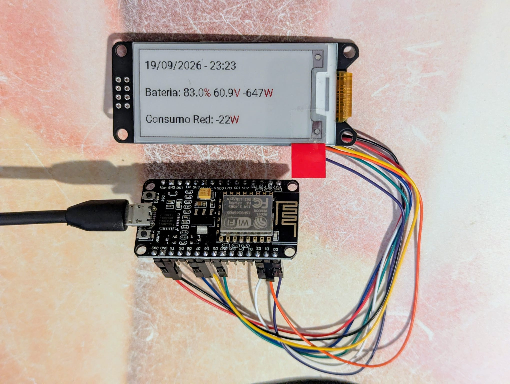

# esphome-weact-2.13

A proof-of-concept project integrating an ESP8266 module with a WeAct
2.13" tricolor (Black/White/Red) e-ink display and Home Assistant,
using [ESPHome](https://esphome.io/).



The device shows, refreshing every 5 minutes (with an almost-immediate
first refresh on boot, without waiting the full 5 minutes):

```
dd/mm/yyyy - hh:mm
Bateria: xx.x% xx.xV [+,-]xxxxW
Consumo Red: xxxxW
```

The units (`%`, `V`, `W`) are drawn in red; everything else in black.
The battery power sign means `+` charging, `-` discharging. (The
on-screen text is in Spanish, matching this particular deployment —
see [Configuration](#configuration) below to adapt it to your own
language or data.)

In this deployment, the values come from a home Victron ESS
(MultiPlus II) battery inverter and a Shelly EM energy meter, both
already exposed as Home Assistant entities:

| Field | Home Assistant entity |
|---|---|
| Battery % | `sensor.victron_system_battery_soc` |
| Battery V | `sensor.victron_system_battery_voltage` |
| Battery W (sign: + charging, - discharging) | `sensor.garage_settings_battery_power_avg_5min` (a *Statistics* helper, 5-minute linear average of `sensor.victron_system_battery_power`) |
| Grid consumption W | `sensor.entrance_shellyem_..._consumo_vivienda_avg_5min` (a *Statistics* helper, 5-minute linear average of the Shelly EM at the mains intake) |

These are specific to this installation — see
[Configuration](#configuration) for how to point the device at your
own Home Assistant entities instead. The two 5-minute-average sensors
are *Helpers* created from the Home Assistant UI (Settings → Devices &
Services → Helpers → Statistics), not YAML, so no production Home
Assistant configuration needs to be touched to reproduce this setup.

### Design notes (non-obvious gotchas)

- **Immediate refresh without colliding with the periodic one.**
  ESPHome fires the first execution of any `interval:`/`update_interval`
  almost immediately on boot (it doesn't wait for the full period).
  Since that was racing with the immediate refresh fired as soon as
  the first Home Assistant data arrived (the automatic one would win
  the race and keep the display busy for ~35s, right when the real
  data showed up), the `interval:` that drives the periodic refresh
  uses a `startup_delay` equal to the interval itself (5 min) so its
  first fire never competes with the immediate refresh from
  `refresh_when_ready` (which wins the race in under a second after
  boot, as soon as SOC/voltage/power/consumption/time are all ready).
- **`get_text_bounds` with LEFT alignment.** Drawing units in a
  different color on the same line requires measuring each text
  segment and concatenating positions. With `TextAlign::LEFT`, the
  `x1` returned by `get_text_bounds` is already the absolute x
  coordinate passed in (not a relative offset) — adding it to the
  running `x` again doubles the advance and pushes later text off
  toward the right edge.

Full original design: [docs/superpowers/specs/2026-09-17-esphome-weact-display-design.md](docs/superpowers/specs/2026-09-17-esphome-weact-display-design.md)
(historical — see this README for the as-built, current design).

## Hardware

- **ESP8266** (NodeMCU, ESP8266EX chip, 4MB flash, CP2102 USB-serial
  chip).
- **WeAct 2.13" B&W&R e-ink panel** (SSD1680 controller, 122×250 px,
  tricolor). [Manufacturer's repository](https://github.com/WeActStudio/WeActStudio.EpaperModule).

### Wiring (hardware SPI bus)

The WeAct module labels its SPI pins with I2C-style names (`SCL`/`SDA`)
even though the bus is SPI, not I2C: `SCL` = SCK (clock), `SDA` = MOSI
(data).

| Pin on the module (silkscreen) | SPI signal | ESP8266 GPIO | NodeMCU pin |
|---|---|---|---|
| CS   | CS   | GPIO15 | D8 |
| SCL  | SCK  | GPIO14 | D5 |
| SDA  | MOSI | GPIO13 | D7 |
| BUSY | BUSY | GPIO16 | D0 |
| RES  | RST  | GPIO5  | D1 |
| D/C  | DC   | GPIO4  | D2 |
| VCC  | VCC  | 3V3 | 3V3 |
| GND  | GND  | GND | GND |

## Software

- [ESPHome](https://esphome.io/) 2026.9.0+ (needs Python ≥3.12 — a
  hard requirement for the `epaper_spi` component that supports this
  tricolor panel).
- PlatformIO (installed automatically by ESPHome as a dependency).

## Installation

### 1. Clone the repository

```bash
git clone https://github.com/MarceloSalazar/esphome-weact-2.13.git
cd esphome-weact-2.13
```

### 2. Set up the Python environment

Everything runs inside a Python virtual environment in `.venv/`,
managed with [`uv`](https://docs.astral.sh/uv/) (needed because most
systems' default Python doesn't meet ESPHome's ≥3.12 requirement):

```bash
# Install uv if you don't have it:
curl -LsSf https://astral.sh/uv/install.sh | sh

# Get a Python 3.12 interpreter and create the venv:
uv python install 3.12
uv venv --python 3.12 .venv

# Install ESPHome (pulls in PlatformIO automatically):
uv pip install --python .venv/bin/python esphome
```

### 3. Serial port access (Linux)

The device is flashed over `/dev/ttyUSB0` (or similar) via a
CP2102/CH340-style USB-serial chip. On Linux, your user needs to be in
the `dialout` group to access it without `sudo`:

```bash
sudo usermod -aG dialout $USER
# then log out and back in (or reboot) for the group change to apply
```

If you just added yourself to the group and don't want to log out yet,
you can prefix commands with `sg dialout -c '...'` for the current
shell session instead.

## Configuration

### 1. Secrets

Copy `secrets.yaml.example` to `secrets.yaml` (gitignored — never
committed) and fill in your real values:

```bash
cp secrets.yaml.example secrets.yaml
```

```yaml
wifi_ssid: "YOUR_WIFI_SSID"
wifi_password: "YOUR_WIFI_PASSWORD"
api_encryption_key: "CHANGE_THIS_BASE64_32_BYTE_KEY"
static_ip: "192.168.1.100"   # pick a free address on your LAN
gateway: "192.168.1.1"
```

Generate a proper encryption key (used for both the native ESPHome API
and encrypted OTA updates) instead of leaving the placeholder:

```bash
python3 -c "import secrets, base64; print(base64.b64encode(secrets.token_bytes(32)).decode())"
```

If you don't want a static IP, delete the `manual_ip:` block in
`weact-display.yaml` and the device will use DHCP instead.

### 2. Point the display at your own Home Assistant entities

Edit the `sensor:` block in `weact-display.yaml` and replace the four
`entity_id:` values with your own Home Assistant sensors (battery
state of charge, battery voltage, battery power, and whatever
represents your grid/house consumption). If your source sensors update
frequently and you want a smoothed reading like this deployment does,
create a *Statistics* helper for each one (Home Assistant → Settings →
Devices & Services → Helpers → Add Helper → Statistics; "Average
linear" over the window you want) and point `entity_id:` at the
helper's entity instead of the raw sensor.

### 3. Customize the display layout (optional)

The screen layout and text live entirely in the `display:` lambda in
`weact-display.yaml`. Edit the `it.print`/`draw_segment` calls to
change the wording, language, units, or layout — see the design notes
above before changing how colored segments are positioned.

## Deployment

### First flash (over USB)

The very first flash must be over USB, since the device isn't on WiFi
yet:

```bash
.venv/bin/esphome compile weact-display.yaml
.venv/bin/esphome upload weact-display.yaml --device /dev/ttyUSB0
.venv/bin/esphome logs weact-display.yaml --device /dev/ttyUSB0
# or, to compile + flash + tail logs in one step:
.venv/bin/esphome run weact-display.yaml --device /dev/ttyUSB0
```

### Later updates (over the network / OTA)

Once the device has joined your WiFi network, you can update and debug
it remotely using its IP address instead of the serial port — no USB
required:

```bash
.venv/bin/esphome upload weact-display.yaml --device 192.168.1.100
.venv/bin/esphome logs weact-display.yaml --device 192.168.1.100
```

### Pairing with Home Assistant

With `api:` configured (see `weact-display.yaml`), Home Assistant
should auto-discover the device via mDNS shortly after it boots:
Settings → Devices & Services → you should see "Discovered" with the
device's name — click **Add**, then enter the `api_encryption_key`
from your `secrets.yaml` when prompted. If auto-discovery doesn't
work on your network (e.g. the device is on an isolated VLAN), add the
integration manually with **Add Integration → ESPHome** and enter the
device's IP address directly.

## Project status

Tracked phase by phase in the [GitHub issues](https://github.com/MarceloSalazar/esphome-weact-2.13/issues)
of this repository.

- [x] Environment (PlatformIO + ESPHome) installed and working
- [x] ESP8266 detected over USB
- [x] Basic firmware compiled and flashed
- [x] Logs readable via the serial monitor
- [x] E-ink panel wired up
- [x] "Hello world!" on the e-ink panel
- [x] WiFi (static IP) + encrypted OTA
- [x] Home Assistant integration (battery status + grid consumption)

## License

[MIT](LICENSE) — free to use, modify, and distribute for any purpose,
with no warranty and no liability on the author's part.
